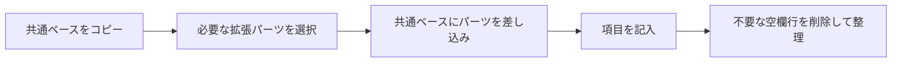
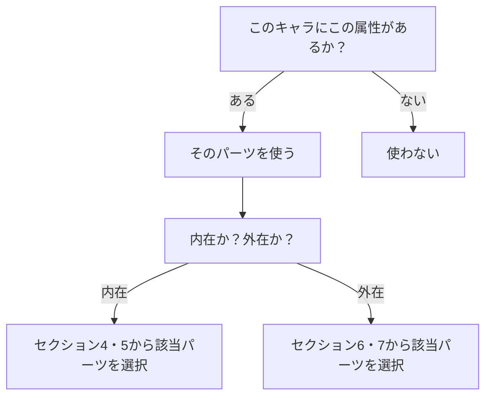

## 3. 使用方法

### 基本フロー

---

### パーツ選択の原則

拡張パーツを選択する際の判断基準は一つだけである。

**「このキャラクターにこの属性があるか否か」**

ジャンルで選ばない。レーティングで選ばない。性別で選ばない。そのキャラクターが該当する属性を持っているなら、そのパーツを使う。持っていないなら使わない。

|判断|例|
|---|---|
|使う|魔法を使えるキャラクター → 魔法パーツを使う|
|使う|SNSをやっているキャラクター → SNS・ネットパーツを使う|
|使う|義手を持つキャラクター → テクノロジー身体パーツを使う|
|使わない|魔法のない世界のキャラクター → 魔法パーツは使わない|
|使わない|恋愛に無関心なキャラクター → 親密・恋愛パーツは使わない|
|使わない|性的描写を行わない作品 → 性的身体詳細パーツは使わない|

---

### パーツ選択ガイド

---

### 共通ベースの扱い

共通ベース21パーツはすべてのキャラクターに適用する骨格情報である。ただし、21パーツすべての全項目を埋める義務はない。

|方針|説明|
|---|---|
|全項目を埋める|キャラクターを最大限に定義したい場合|
|必要な項目だけ埋める|作品に必要な情報だけ管理したい場合|
|段階的に埋める|最初は最低限だけ埋め、必要に応じて追記していく場合|

重要なのは「埋めなければならない」ではなく「問いかけが存在する」ことである。空欄は「未定義」であって「不備」ではない。

---

### 差し込み位置の原則

拡張パーツは、共通ベースの関連パーツの直後に差し込んで使用する。

|拡張パーツ|差し込み先（共通ベースの直後）|
|---|---|
|体格|種族・身体特徴|
|身体の機微・反応|クセ・無意識の行動|
|胸部・男性器・女性器・臀部・体毛・陰毛・性的機能|種族・身体特徴|
|嗜好・プレイ傾向・特殊嗜好|基本的な性的傾向|
|習慣・所持品（性的）|生活・日常|
|食文化|身体・健康|
|睡眠|身体・健康|
|知覚・五感|感覚・嗜好|
|記憶|知性・教養|
|時間感覚|クセ・無意識の行動|
|死生観|性格・内面|
|衛生観念|生活・日常|
|笑いのツボ|性格・内面|
|方向感覚|身体・健康|
|神経多様性・認知特性|性格・内面|
|身体リズム・生理周期|身体・健康|
|変性意識・トランス|クセ・無意識の行動|
|声・発声の身体性|声・言語|
|衣服と身体の相互作用|ファッション|
|痛み・不調の表現|身体・健康|
|所有と身体の関係|ペット・所有物|
|メイク|外見|
|下着|ファッション|
|小物|ファッション|
|チャーム・魅力|外見|
|親密・恋愛|対人関係|
|見せ方・演出|イメージ|
|移動・身体動作|外見|
|創作・表現|声・言語|
|動物との関係|対人関係|
|戦闘・能力|ストーリー|
|魔法|ストーリー|
|SNS・ネット|社会・文化背景|
|テクノロジー身体|種族・身体特徴|

---

### 用途別おすすめ構成

|用途|構成|パーツ数目安|
|---|---|---|
|最小構成（メモ程度）|外在共通の基本情報＋外見＋内在共通の性格・内面|3パーツ|
|ライトに使いたい|共通ベース21パーツ、不要な項目は空欄|21パーツ|
|イラスト発注・キャラデザ共有|外見＋種族・身体特徴＋ファッション＋体格＋メイク＋小物＋イメージ|7パーツ|
|小説・漫画の創作|共通ベース全部＋キャラに該当する拡張パーツ|21＋α パーツ|
|TRPG|共通ベース全部＋戦闘・能力＋魔法＋知覚・五感|24パーツ|
|R18作品|共通ベース全部＋性的身体詳細＋性的傾向系＋親密・恋愛|30〜40パーツ|
|キャラ深掘り遊び|61パーツすべて、埋められるだけ埋めて楽しむ|61パーツ|
|AIキャラクター定義|共通ベース全部＋キャラに該当する拡張パーツ全部|用途に応じて|
|チーム制作|共通ベース全部＋必要な拡張＋管理情報を厳密に運用|用途に応じて|

---

### 記入のガイドライン

|指針|説明|
|---|---|
|自由記述|すべての項目は自由記述。選択式ではない。記入例はあくまで参考|
|量の制約なし|一言でも長文でも構わない。キャラクターの情報量に応じて自由に|
|矛盾を恐れない|記入後に矛盾に気づいたら、その矛盾自体がキャラクターの発見になる|
|変更可能|記入後の変更は自由。BONECDはスナップショットであり、更新して良い|
|他パーツとの参照|複数パーツにまたがる情報は、関連パーツに相互参照のメモを残すと便利|

---
